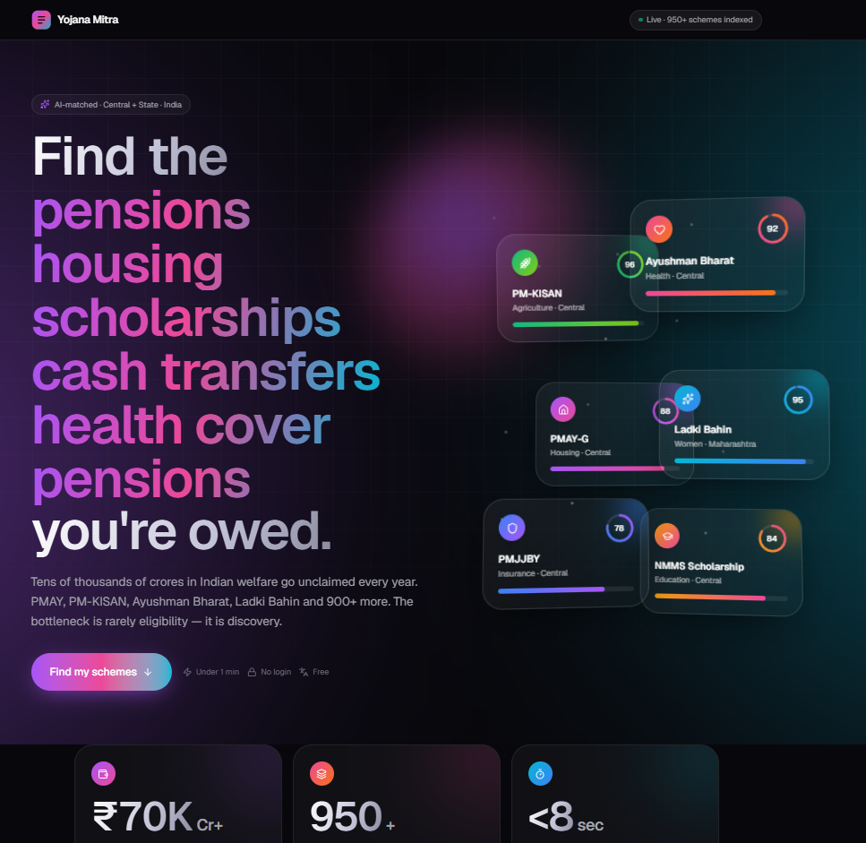
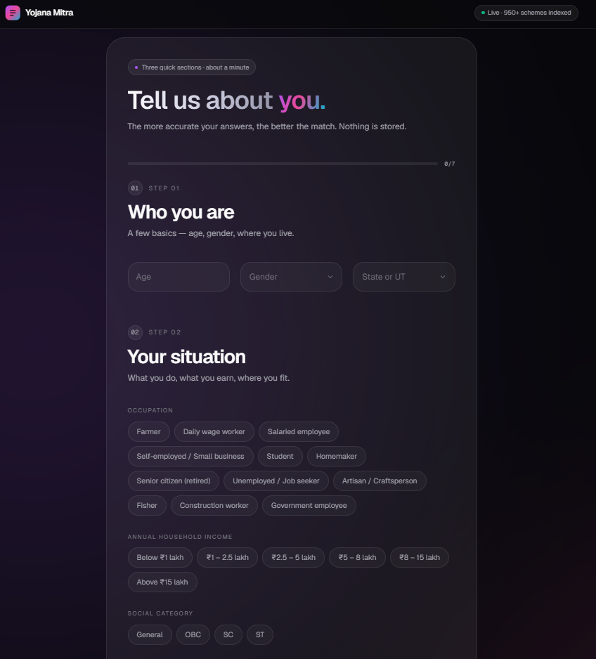
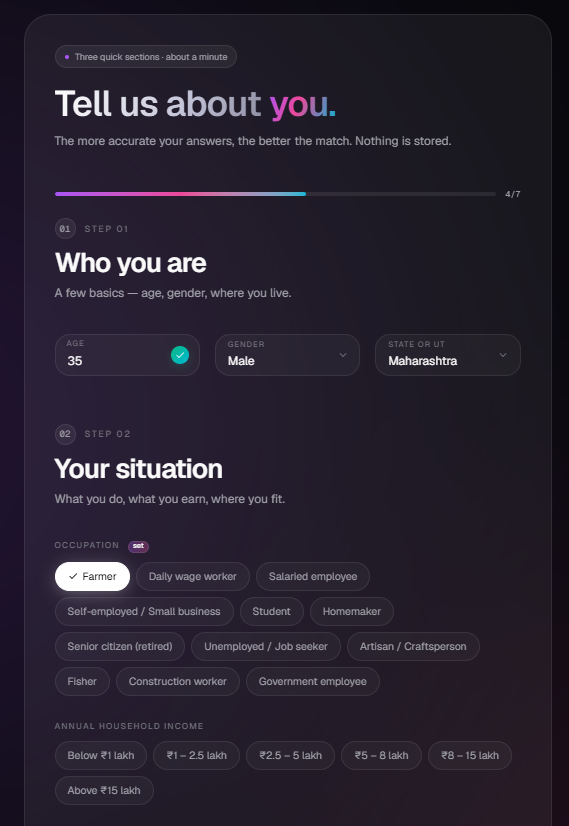
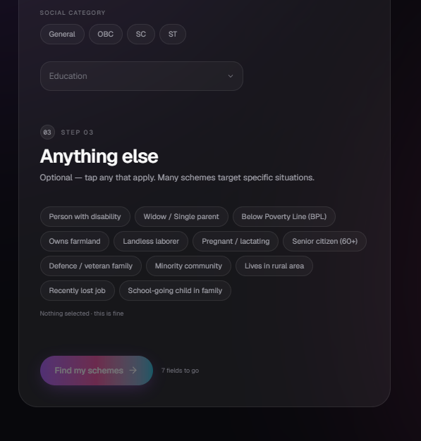
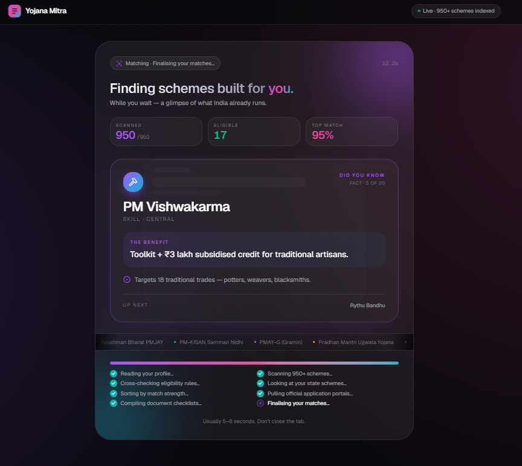
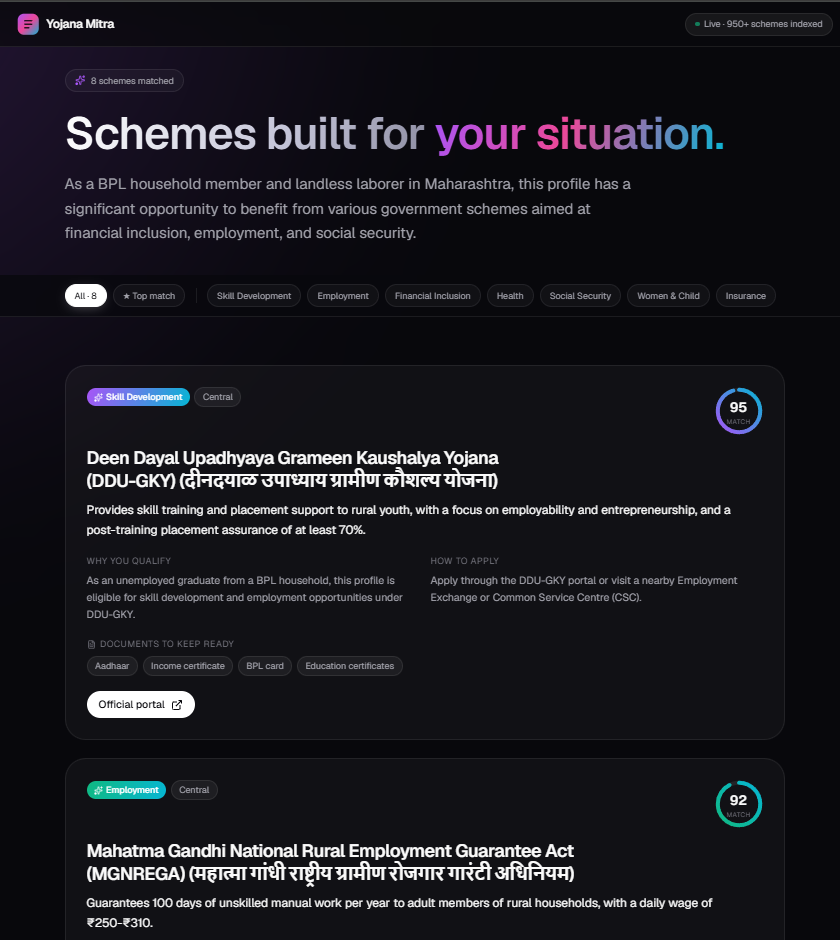
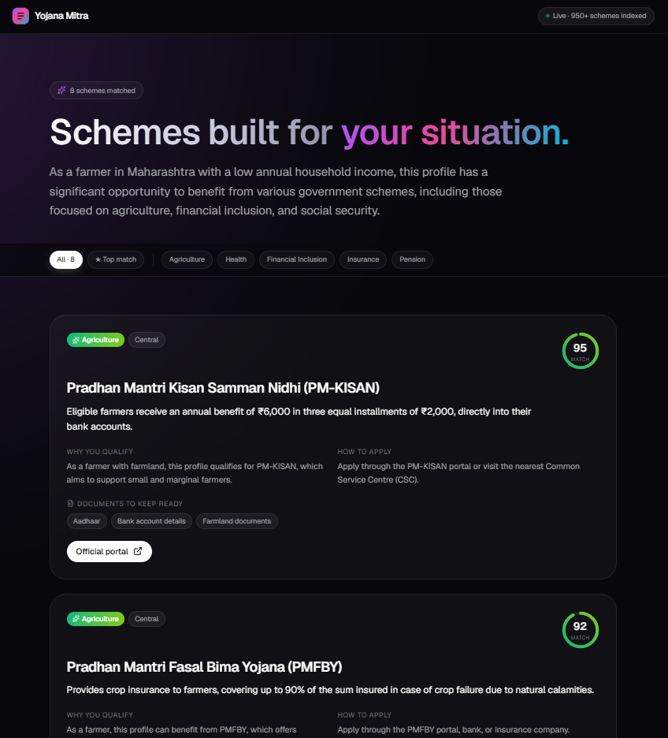

# Yojana Mitra

> A short profile reveals the Indian central and state welfare schemes you may qualify for. Built for citizens, social workers, and panchayats.

Tens of thousands of crores in Indian government welfare benefits go unclaimed every year — pensions, scholarships, housing support, cash transfers, free health cover. The bottleneck is rarely eligibility; it is discovery. **Yojana Mitra** takes a one-minute profile and asks an LLM to surface the 6–8 most relevant schemes (Central + State) for that person, with how to apply and what documents to keep ready.

---

## Screenshots

### Landing

<p align="center">
  
</p>

<sub>Hero with rotating benefit words (pensions / housing / scholarships / cash transfers / health cover), an interactive 3D stack of scheme cards that tilts on cursor parallax, and three stat tiles (₹70K Cr+ unclaimed · 950+ schemes · &lt;8 sec to match).</sub>

### Profile form

<table>
  <tr>
    <td valign="top"></td>
    <td valign="top"></td>
  </tr>
  <tr>
    <td align="center"><sub>Empty — completion bar at 0/7, Step 01 (Age / Gender / State), Step 02 chip grids.</sub></td>
    <td align="center"><sub>Filling in — floating labels float, "set" chip on Occupation, gradient progress bar at 4/7.</sub></td>
  </tr>
</table>

<p align="center">
  
</p>

<sub>Bottom — Step 03 multi-select chips for special statuses (PwD, widow, BPL, owns farmland, senior 60+, minority, rural, etc.) and the gradient violet→pink→cyan submit button.</sub>

### Loading

<p align="center">
  
</p>

<sub>While DeepInfra works (~5–8 s), a theatre keeps the user engaged: live status pill, three counters (Scanned ticking to 950 · Eligible · Top match), 3D-stacked scheme fact card that rotates every 2.6 s with category-tinted glow, marquee ticker of all scheme names, and an 8-step checklist that advances as it goes.</sub>

### Results

<table>
  <tr>
    <td valign="top"></td>
    <td valign="top"></td>
  </tr>
  <tr>
    <td align="center"><sub>BPL household, landless laborer, Maharashtra — DDU-GKY skill training (95) and MGNREGA employment guarantee (92).</sub></td>
    <td align="center"><sub>Farmer, Maharashtra — PM-KISAN ₹6,000/year (95) and PMFBY crop insurance (92).</sub></td>
  </tr>
</table>

<sub>Match score animates as a gradient SVG ring sized by score. Category pills carry per-category gradients (agri = emerald-lime, skill = violet-cyan, health = pink-orange, etc.). Sticky filter bar with All / Top match / per-category chips.</sub>

---

## Stack

- **Next.js 16** (App Router, RSC) with TypeScript
- **Tailwind CSS v4** + **shadcn/ui** (radix-nova preset, neutral base, CSS variables)
- **DeepInfra** for inference — model `meta-llama/Llama-3.3-70B-Instruct`, `response_format: json_object`
- **Upstash Redis + Ratelimit** — 5 requests / hour / IP on `/api/schemes`
- **Zod v4** — strict server-side validation of the form payload
- **lucide-react** icons, **sonner** toasts
- Fonts: **Geist Sans** (UI) + **Geist Mono** (labels, counters)
- Pure CSS 3D for the hero card stack (cursor parallax via `requestAnimationFrame`) — no three.js, no other heavy deps

The DeepInfra API key lives only in `process.env` on the server. Nothing in the client bundle references it.

---

## Local setup

```bash
git clone <this-repo>
cd Yojana-Mitra
npm install
cp .env.example .env.local
# fill in the three keys (see below)
npm run dev
```

Open <http://localhost:3000>. Fill the form. Hit "Find my schemes →".

### Environment variables

| Var | Where to get it | Required |
|-----|-----------------|----------|
| `DEEPINFRA_API_KEY` | <https://deepinfra.com> → API Keys | Yes |
| `UPSTASH_REDIS_REST_URL` | <https://console.upstash.com> → create Redis DB | Recommended (in production) |
| `UPSTASH_REDIS_REST_TOKEN` | Same Upstash DB → REST token | Recommended (in production) |
| `NEXT_PUBLIC_SITE_URL` | Your deployment URL — used in `sitemap.ts` | Optional |

If the Upstash vars are missing, the rate limiter is disabled (handy for local dev) but the route still works. **Do not deploy publicly without them** — one viral share of an unprotected API costs real money in DeepInfra credits.

---

## Project layout

```
src/
  app/
    layout.tsx            # fonts, metadata, Toaster
    page.tsx              # hero + form, or results
    globals.css           # design tokens (paper/ink/terracotta)
    robots.ts / sitemap.ts
    api/schemes/route.ts  # POST → ratelimit → Zod → DeepInfra → return
  components/
    profile-form.tsx      # 3 sections, completion bar, chip groups
    combobox.tsx          # searchable accessible dropdown (gender, state, education)
    floating-input.tsx    # Material-style floating-label input (age)
    chip-group.tsx        # ChipGroup (single) + ChipMulti
    section-header.tsx    # "01 · Step 01 / Title" header
    hero-visual.tsx       # 3D scheme card stack with cursor parallax
    rotating-word.tsx     # animated word swap for hero
    loading-theatre.tsx   # full loading state while API runs
    results-view.tsx      # filterable list of scheme cards
    scheme-card.tsx       # one card per scheme (gradient match ring)
    ornament.tsx          # gradient logo mark
    header.tsx, footer.tsx
    ui/                   # shadcn outputs (button, input, dialog, …)
  lib/
    constants.ts          # states, occupations, incomes, statuses
    system-prompt.ts      # LLM system prompt (verbatim from spec)
    schema.ts             # Zod schema for the form payload + LLM response
    scheme-facts.ts       # 20 real scheme facts shown during loading
    deepinfra.ts          # client + JSON-extraction helper
    ratelimit.ts          # Upstash sliding-window 5/hour/IP
    utils.ts              # shadcn cn()
```

---

## API contract

`POST /api/schemes` — body:

```json
{
  "age": 28,
  "gender": "Female",
  "state": "Maharashtra",
  "occupation": "Farmer",
  "income": "₹1 – 2.5 lakh",
  "category": "OBC",
  "education": "Class 12 (HSC)",
  "specialStatuses": ["Owns farmland", "Lives in rural area"]
}
```

Response (200):

```json
{
  "summary": "…",
  "schemes": [
    {
      "name": "Pradhan Mantri Kisan Samman Nidhi (PM-KISAN)",
      "category": "Agriculture",
      "level": "Central",
      "benefit": "₹6,000/year direct income support …",
      "why_eligible": "…",
      "how_to_apply": "Register at pmkisan.gov.in or via your CSC.",
      "official_url": "https://pmkisan.gov.in",
      "match_score": 94,
      "key_documents": ["Aadhaar", "Bank passbook", "Land records"]
    }
  ]
}
```

Status codes:

- `200` – schemes returned, sorted by `match_score` descending
- `400` – body failed Zod validation
- `429` – rate limit hit (includes `Retry-After` header)
- `502` – upstream model/parse error

---

## Deploying to Vercel

1. Push this repo to GitHub.
2. <https://vercel.com> → **Add New Project** → import the repo.
3. **Settings → Environment Variables** — add the three keys for both Production and Preview.
4. Deploy. First push gives `yojana-mitra-<hash>.vercel.app`.
5. (Optional) Add a custom domain — `.in` is ~₹700/year, `.app` ~₹1500/year. Vercel → Domains → Add → follow the DNS instructions.
6. Smoke-test:
   - Submit a real profile, confirm 6–8 schemes return in < 8 seconds.
   - Hit the route 6 times within an hour — the 6th should 429.
7. Add the deployed URL to Google Search Console; submit the sitemap.

### Cost projection

At ~2K input + ~1.5K output tokens per call and Llama-3.3-70B pricing (~$0.23/M input, $0.40/M output), **1,000 daily form submissions ≈ ₹450/month**. Vercel free tier and Upstash free tier (10K commands/day) cover this volume.

### Swapping models

Change `MODEL` in [src/lib/deepinfra.ts](src/lib/deepinfra.ts#L2). DeepInfra exposes Llama 3.x, Qwen, DeepSeek, Mistral, and others under an OpenAI-compatible Chat Completions API — no other code changes needed as long as the model supports `response_format: json_object`.

---

## Design system

Modern dark SaaS — deep slate base with an animated aurora mesh, frosted-glass surfaces, and a violet → pink → cyan gradient as the brand thread. No tricolor clichés. Tokens live in [src/app/globals.css](src/app/globals.css):

| Token | Value | Use |
|-------|-------|-----|
| `--background-base` | `#08080c` | Page background |
| `--surface` | `rgba(255,255,255,0.035)` | Glass cards (default) |
| `--surface-2` | `rgba(255,255,255,0.06)` | Glass cards (active/strong) |
| `--text-primary` | `#fafafa` | Headlines, primary text |
| `--text-secondary` | `#a1a1aa` | Body copy |
| `--text-muted` | `#71717a` | Meta labels, hints |
| `--violet` | `#a855f7` | Primary accent, CTA |
| `--pink` | `#ec4899` | Secondary accent, destructive |
| `--cyan` | `#06b6d4` | Tertiary accent |
| `--emerald` | `#10b981` | Success (valid input, completed step) |
| `--line` | `rgba(255,255,255,0.08)` | Dividers, borders |

Decorative elements:
- **Aurora mesh** — two large radial-blob gradients drift over 22 s / 28 s in opposite directions, blurred to 120 px
- **Gradient logo mark** — rounded violet→pink→cyan square with a 3-line monogram inside
- **3D hero card stack** — six floating mini-cards at different Z-depths with cursor parallax, gentle continuous float + tilt
- Match scores render as animated SVG rings (gradient stroke, `stroke-dasharray` keyed to score)
- Subtle dotted grid overlay in hero, masked to a vignette so it fades into the bg

---

## What's NOT in v1 (intentional)

- No user accounts / signup — friction kills the proposition.
- No URL allowlist — the LLM-returned URLs are shown with a clear disclaimer that users must verify on official portals. A maintained allowlist is the right v2 move.
- Results are stored in client state only — refresh wipes them. A `sessionStorage`-backed `/results/<uuid>` route is on the roadmap.

---

## Roadmap (priority order)

1. Hindi language toggle (`lib/i18n.ts` + prompt language flag)
2. Save & share `/r/<uuid>` permalink with Upstash 30-day TTL
3. PDF export of matched schemes (`@react-pdf/renderer`)
4. WhatsApp share button (`wa.me` deep link with top 3 schemes)
5. Voice input via Whisper
6. Per-scheme deep-dive pages with FAQ + filled-form samples
7. State-wise SEO landing pages (`/in/maharashtra`, etc.)
8. Eligibility verification follow-up chat
9. Telegram / WhatsApp bot frontend

---

## License

MIT. Use freely.

---

## A note on accuracy

Scheme eligibility, benefits, deadlines, and application steps change. The LLM is good at surfacing candidates but not authoritative. **Always verify on the official Government of India / state portal before applying.** When in doubt, the nearest Common Service Centre (CSC), panchayat office, or municipal ward office can help.
